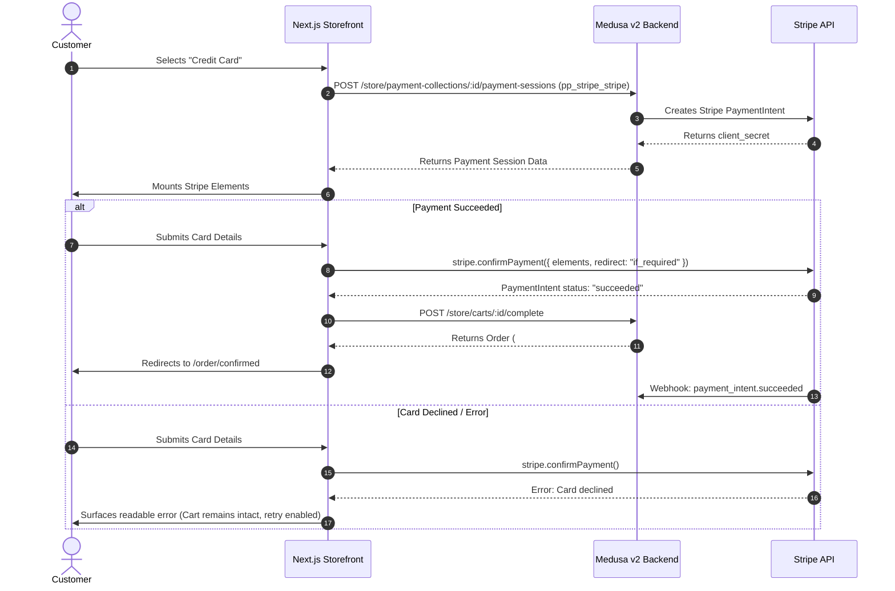

# Production Stripe Integration & Webhook Guide

This guide documents the configuration, webhook architecture, and signature validation for the official Stripe payment integration in the Medusa v2 backend and Next.js storefront for **London Boy** (`londonboy.uk`).

---

## 1. Architecture & Module Configuration

Medusa v2 uses the official `@medusajs/medusa/payment-stripe` provider module registered under `@medusajs/medusa/payment` in `medusa-config.ts`.

### Provider Identification
- **Module ID in medusa-config.ts**: `stripe`
- **Internal Provider ID**: `pp_stripe_stripe`
- **Storefront Display**: `Credit / Debit Card (Visa, MasterCard, Amex)`

### Environment Variables

| Variable | Location | Description | Scope |
| :--- | :--- | :--- | :--- |
| `STRIPE_API_KEY` | `apps/backend/.env` | Stripe Secret API Key (`sk_test_...` or `sk_live_...`) | Backend Only (Secret) |
| `STRIPE_WEBHOOK_SECRET` | `apps/backend/.env` | Stripe Webhook Signing Secret (`whsec_...`) | Backend Only (Secret) |
| `NEXT_PUBLIC_STRIPE_KEY` | `apps/storefront/.env.local` | Stripe Publishable Key (`pk_test_...` or `pk_live_...`) | Storefront Public |

> [!CAUTION]
> **Secret Key Policy**: Never commit real API keys or webhook secrets to version control. Keep only `.env.template` with placeholders in the repository.

---

## 2. Production Webhook Configuration

### Webhook Endpoint URL
In production, configure your Stripe Dashboard Webhook to point directly to Medusa's payment hook endpoint:

```text
https://londonboy.uk/hooks/payment/stripe_stripe
```

*(For local testing with the Stripe CLI: `stripe listen --forward-to localhost:9000/hooks/payment/stripe_stripe`)*

### Required Webhook Events

When configuring the webhook in the Stripe Developer Dashboard, subscribe to the following 4 events:

1. **`payment_intent.succeeded`**: Triggered when a customer's payment succeeds. Medusa automatically marks the payment session status as authorized/captured.
2. **`payment_intent.amount_capturable_updated`**: Triggered when a payment requires separate manual capture (if automatic capture is disabled).
3. **`payment_intent.payment_failed`**: Triggered when a payment attempt fails or card is declined. Updates the session state without corrupting the cart.
4. **`payment_intent.partially_funded`**: Triggered for multi-part or bank-funded payments.

---

## 3. Webhook Signature Validation

Medusa automatically validates the `stripe-signature` header on all incoming webhook requests against `process.env.STRIPE_WEBHOOK_SECRET`.

- Requests missing a valid `stripe-signature` header return `400 Bad Request` or `401 Unauthorized`.
- Tampered or replayed payloads are rejected.
- Valid requests return `200 OK` and trigger internal Medusa payment workflows.

---

## 4. Payment Lifecycle & Error Handling



---

## 5. Security & Idempotency Guarantees

1. **Double Submission Protection**: A React `useRef` lock prevents simultaneous duplicate `placeOrder` or `confirmPayment` calls.
2. **Order Idempotency**: Cart completion in Medusa v2 transitions the cart into an order atomically. Repeated completion calls on the same cart return the existing order.
3. **Inventory Allocation**: Inventory reservations are executed inside Medusa's distributed order creation workflow, ensuring stock is decremented exactly once per order.
