# London Boy E-Commerce: 60–90 Second Browser Walkthrough Guide

This interactive walkthrough demonstrates the complete end-to-end commerce lifecycle of **London Boy Direct-to-Consumer Menswear**, transitioning seamlessly from customer discovery to order fulfillment and demo state reset.

---

## Walkthrough Summary

| Step | Action | Route | Key Verification Point | Visual Reference |
| :---: | :--- | :--- | :--- | :--- |
| **01** | Open Storefront | `/` | Hero branding, department navigation, London Boy seed catalog | `step-01-open-storefront.png` |
| **02** | Browse Catalog | `/shop/` | Search bar, category filters, responsive product grid | `step-02-browse-catalog.png` |
| **03** | Select Size & Color | `/product/?handle=heavyweight-t-shirt` | Color swatches, size selector (M/L), real-time stock badge | `step-03-select-variant.png` |
| **04** | Add to Bag | `/cart/` | Shopping bag drawer opens, item quantity & price calculated | `step-04-cart-contents.png` |
| **05** | Apply Promo Code | `/cart/` | Code `LONDON10` applies instant 10% discount on order subtotal | `step-05-apply-promo.png` |
| **06** | Complete Checkout | `/checkout/` | Customer shipping details, delivery method, instant test order placement | `step-06-order-placed.png` |
| **07** | Open Demo Admin | `/demo-admin/` | Admin KPI metrics, revenue summary, operational pipeline | `step-07-open-admin.png` |
| **08** | Locate New Order | `/demo-admin/orders/` | Order appears at top of pipeline in "Pending Confirmation" status | `step-08-find-order.png` |
| **09** | Update Fulfillment | `/demo-admin/order/?id=...` | Status changed to "Shipped" with courier tracking number attached | `step-09-change-order-status.png` |
| **10** | Verify in Account | `/account/orders/` | Customer order portal immediately reflects updated "Shipped" status | `step-10-account-updated-status.png` |
| **11** | Reset Demo Data | `/demo-admin/settings/` | Two-step confirmation restores clean seed catalog and clears custom state | `step-11-reset-demo.png` |

---

## Detailed Step-by-Step Narrative

### Step 1: Open Storefront
- **URL**: `http://localhost:8080/` (or [Live Demo](https://asifshawon.github.io/clothing-store-next-medusa/))
- **Narrative**: The visitor arrives at the London Boy homepage. The header prominently displays the brand identity, navigation categories (*Men, Women, Accessories*), search toggle, customer account link, and shopping bag. A persistent top banner informs visitors that this is a zero-backend portfolio demonstration running on client-side storage.

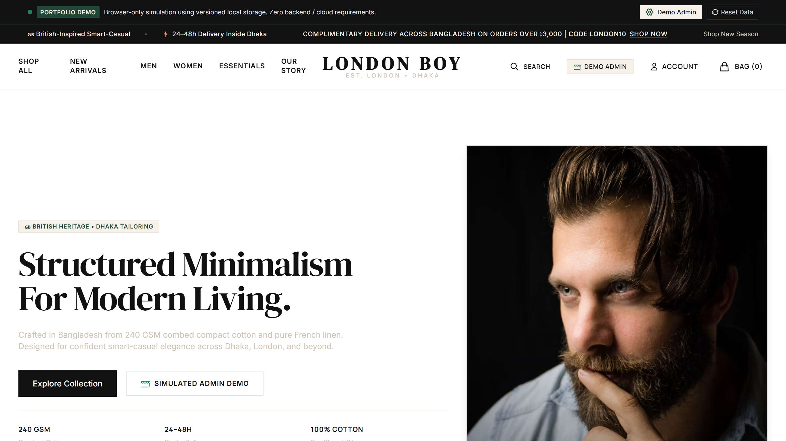

---

### Step 2: Browse the Catalog
- **URL**: `/shop/`
- **Narrative**: Navigating to the catalog reveals the curated London Boy collection (6 bespoke garments with 38 variants). Visitors can filter by category (*T-Shirts, Knitwear, Caps, Shirts, Chinos*), price range, or instant keyword search.

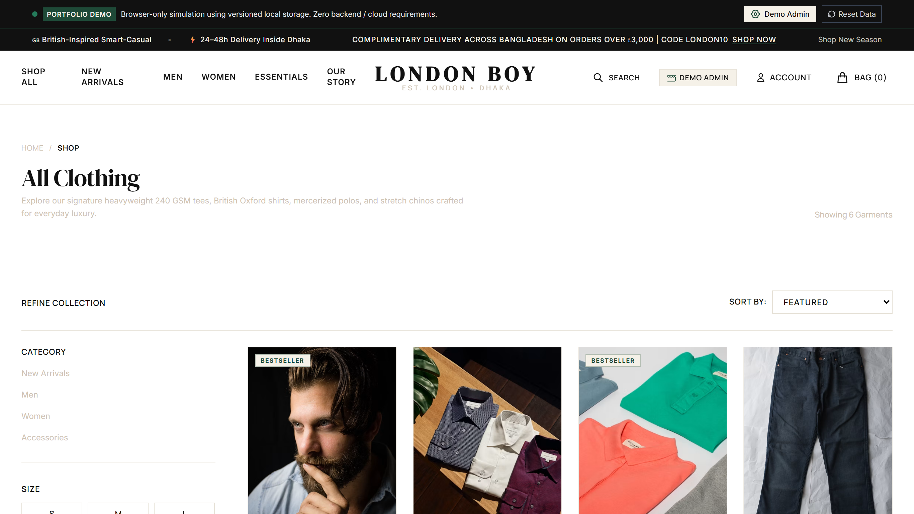

---

### Step 3: Select Size and Color
- **URL**: `/product/?handle=heavyweight-t-shirt`
- **Narrative**: On the Product Detail Page (PDP), the visitor examines the high-resolution gallery, fabric specifications, and size chart modal. Selecting the **Vintage Black** colorway and size **M** dynamically updates the active SKU, price display (৳1,250 BDT), and inventory status.

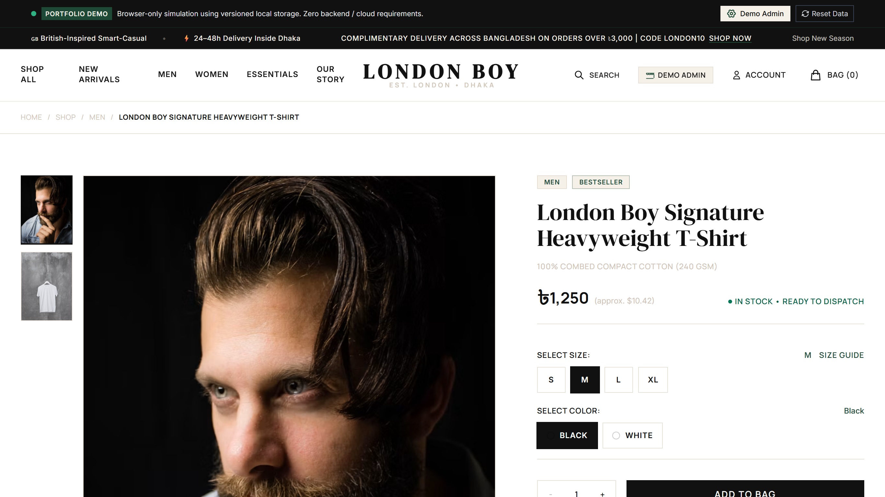

---

### Step 4: Add to Bag
- **URL**: `/cart/`
- **Narrative**: Clicking **"Add to Shopping Bag"** writes the selected variant into the cart. Opening the bag displays itemized line items, quantity increment controls, and estimated order subtotal.

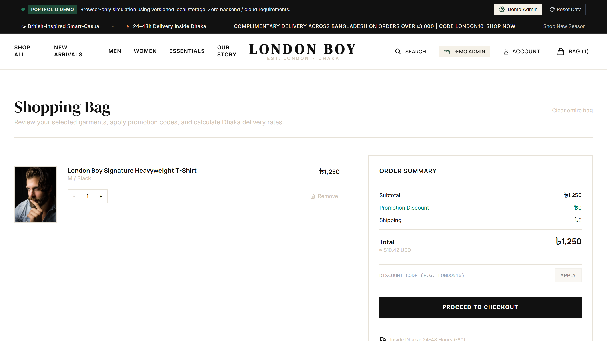

---

### Step 5: Apply Coupon `LONDON10`
- **URL**: `/cart/`
- **Narrative**: Entering the promotional discount coupon `LONDON10` and clicking **Apply** triggers the promotional pricing engine. The subtotal recalculates with an instant 10% deduction, displaying the coupon badge and updated summary.

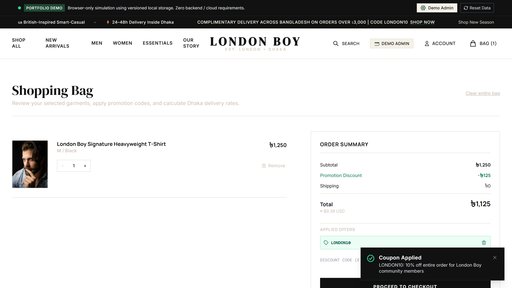

---

### Step 6: Complete Demo Checkout
- **URL**: `/checkout/`
- **Narrative**: The visitor proceeds through the multi-step checkout workflow:
  1. **Customer & Shipping**: Entering customer email, name, and London delivery address.
  2. **Delivery**: Selecting Express Courier (৳120 BDT).
  3. **Payment**: Selecting Cash on Delivery / Simulated Test Payment.
  4. Clicking **"Place Order"** creates order `LB-ORD-1002`, decrements variant inventory, and redirects to the order receipt page.

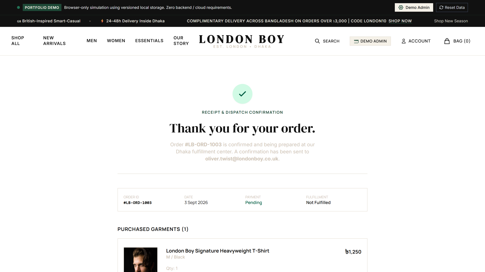

---

### Step 7: Open Demo Admin
- **URL**: `/demo-admin/`
- **Narrative**: The visitor navigates to the simulated merchant administration suite at `/demo-admin/`. The dashboard presents real-time aggregate statistics: Gross Revenue, Order Volume, Average Order Value (AOV), and Active Inventory levels.

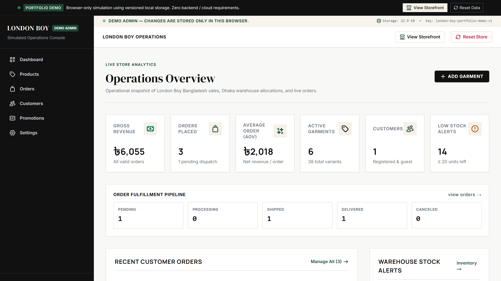

---

### Step 8: Locate the New Order
- **URL**: `/demo-admin/orders/`
- **Narrative**: Opening the Orders table shows the newly created order listed at the top with status `Pending Confirmation`, customer details (*Oliver Twist*), items count, and order total.

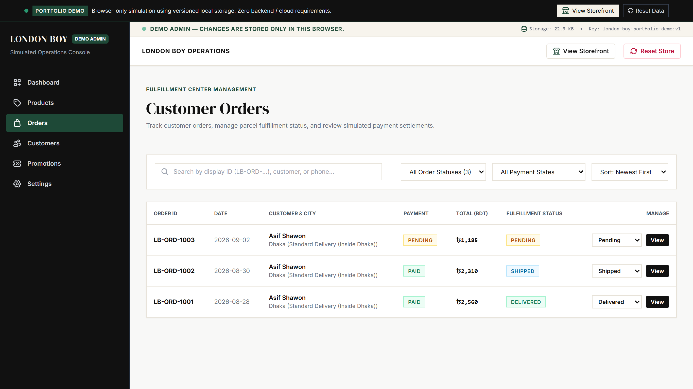

---

### Step 9: Change Order Status & Add Tracking
- **URL**: `/demo-admin/order/?id=...`
- **Narrative**: The administrator opens the order detail page, adjusts the fulfillment status from `Pending` to **`Shipped`**, enters courier tracking reference `LND-EXP-8842-GB`, and saves the update.

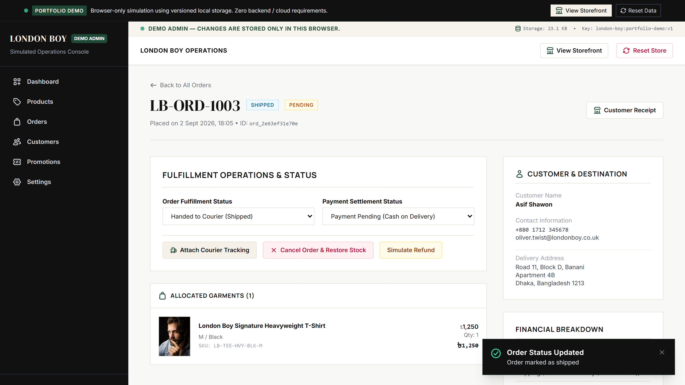

---

### Step 10: Verify Updated Status in Customer Account
- **URL**: `/account/orders/`
- **Narrative**: Switching back to the customer account view demonstrates instant cross-view synchronization. The order status badge immediately shows **`Shipped`** with the attached courier tracking code visible on the customer receipt.

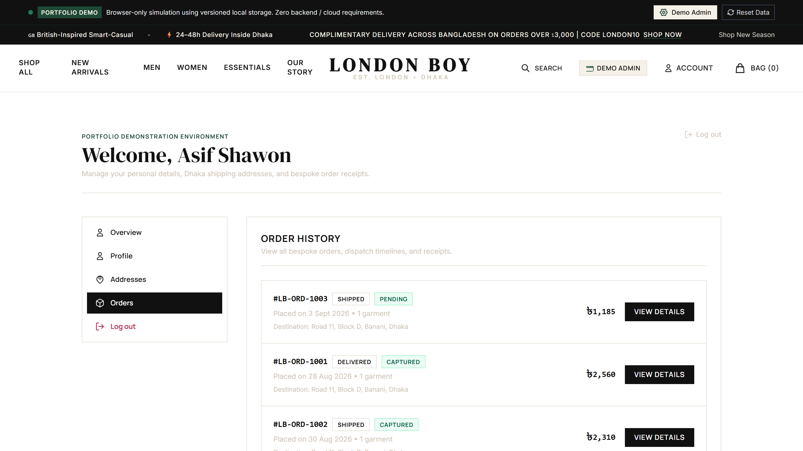

---

### Step 11: Reset Demo Data
- **URL**: `/demo-admin/settings/`
- **Narrative**: In Admin Settings (or via the persistent header badge), clicking **"Reset Demo Data"** and confirming the prompt instantly purges all custom orders and resets the catalog to the initial 6 products and 38 variants.

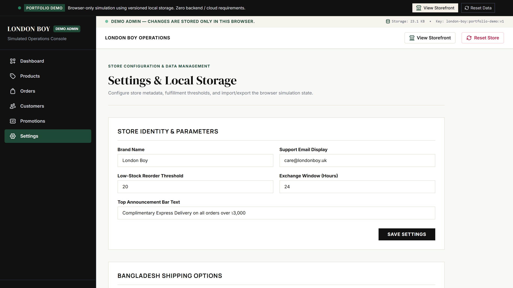

---

## Technical Highlights Demonstrated

1. **Deterministic State Transition**: Seamless checkout-to-admin workflow with zero server roundtrips.
2. **Cross-Tab & Cross-View Sync**: Direct DOM updates and storage listener synchronization across separate browser tabs.
3. **Storage Resilience**: Schema migrations, automatic quota pruning, and corrupt state self-healing.
4. **Zero-Risk Environment**: Completely sandboxed client session with zero database or API vulnerability.
